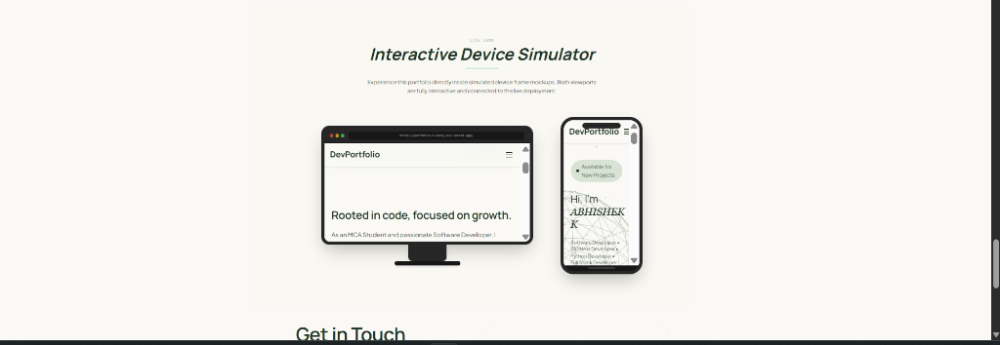

# 🚀 Premium Developer Portfolio (React + TypeScript + Tailwind + Vite)



A modern, highly interactive, and visually stunning developer portfolio tailored for Full-Stack Developers, Python Engineers, and ERPNext/Frappe specialists. It features scroll-spy navigation, a 3D atomic orbits skills display, an interactive work terminal timeline, and live browser mocks for projects.

---

## 💻 Live Screen Section Preview (Mockup Design)

When viewing projects with deployment links, the portfolio embeds a live viewport mockup styled like a modern computer screen/web browser window:

```
 ┌──────────────────────────────────────────────────────────┐
 │ ● ● ●   https://portfolio-2-sooty-six.vercel.app/  [LIVE]│ ◄── Browser Chrome (Traffic dots & URL)
 ├──────────────────────────────────────────────────────────┤
 │                                                          │
 │                                                          │
 │              [ LIVE DEPLOYED LANDING PAGE ]              │ ◄── Interactive scaled iframe preview
 │                                                          │
 │                                                          │
 └──────────────────────────────────────────────────────────┘
```

- **Responsive Scaling**: The embedded website scales dynamically to fit the card layout using a `ResizeObserver` script.
- **Static Fallback**: Automatically switches to an animated custom gradient card with relevant technology icons if no live link is present.

---

## 🛠️ Technology Stack

This application is built with modern web technologies:

- **Core framework**: [React 19](https://react.dev/) + [TypeScript](https://www.typescriptlang.org/) (Type-safe components and modular properties)
- **Build tool**: [Vite](https://vite.dev/) (Instant HMR and optimized asset bundling)
- **Styling System**: [Tailwind CSS v4](https://tailwindcss.com/) (Fluid spacing tokens and utility variables)
- **Animations**: [Framer Motion 12](https://www.framer.com/motion/) (Scroll-linked page transformations, springy interactions, and tab active states)
- **3D Graphics**: [Three.js](https://threejs.org/) (Interactive math-based particle constellation background)
- **Graphics & Vector**: [Lottie React](https://github.com/team-lottie/lottie-react) (Smooth vector vector graphics)
- **Scrolling physics**: [Lenis Scroll](https://lenis.darkroom.engineering/) (Smooth scroll dynamics)

---

## ⚡ Prerequisites

To download, run, and modify this project, you need:

1.  [Node.js](https://nodejs.org/) (v18.0.0 or higher recommended)
2.  [npm](https://www.npmjs.com/) (v9.0.0 or higher) or [yarn](https://yarnpkg.com/)

---

## 🚀 Quick Start

Follow these steps to run the portfolio on your local machine:

### 1. Clone & Navigate

```bash
git clone <repository-url>
cd Portfolio_2
```

### 2. Install Dependencies

```bash
npm install
```

### 3. Start Local Development Server

```bash
npm run dev
```

Open `http://localhost:5173` in your browser to view the portfolio.

### 4. Build for Production

To generate minified, type-checked production bundle files under `/dist`:

```bash
npm run build
```

---

## 🧬 Code Structure & Architecture

```
src/
├── assets/                     # Hashed assets (place your resume.pdf, logos, JSON animations here)
├── components/
│   ├── layout/
│   │   ├── Navbar.tsx          # Scroll-spy navigation with Typewriter logo shift fixes
│   │   ├── SideSocialBar.tsx   # Fixed vertical social layout links
│   │   └── Footer.tsx          # Copyright & footer links
│   └── sections/
│       ├── Hero.tsx            # Available badges + responsive natural margins
│       ├── About.tsx           # Lottie vectors + detailed credentials
│       ├── Expertise.tsx       # Tilted 3D atomic orbital skill badges with drag logic
│       ├── Experience.tsx      # Interactive work tab-explorer workspace terminal
│       ├── Education.tsx       # 3D staircase climb scroll tracker (character walking layout)
│       └── Projects.tsx        # Mobile horizontal swipers & desktop cluster layout viewports
├── App.tsx                     # Entry section stack & Lenis config
└── main.tsx                    # React DOM mounting
```

---

## 📂 How to Customize This Portfolio For Yourself

If you want to adopt this design, follow these guidelines to make it yours:

### 1. Change Personal Details & Bio

Open [src/components/sections/About.tsx](file:///c:/Users/abhis/Desktop/Portfolio_2/src/components/sections/About.tsx) and [src/components/sections/Hero.tsx](file:///c:/Users/abhis/Desktop/Portfolio_2/src/components/sections/Hero.tsx) to modify titles, descriptions, and introductory copy text.

### 2. Update the Professional Experience

Open [src/components/sections/Experience.tsx](file:///c:/Users/abhis/Desktop/Portfolio_2/src/components/sections/Experience.tsx). Update the `experiences` array configuration with your titles, durations, tasks, and tech stack badges:

```typescript
const experiences = [
  {
    role: "Your Job Title",
    company: "Company Name",
    location: "City, Country",
    period: "Start — End Date",
    color: "#HexColor", // Associated brand color
    icon: "material_icon", // Symbol identifier
    tech: ["Skill1", "Skill2"],
    bullets: [
      "Key achievement bullet point 1.",
      "Key achievement bullet point 2.",
    ],
  },
];
```

### 3. Add Your Projects

Open [src/components/sections/Projects.tsx](file:///c:/Users/abhis/Desktop/Portfolio_2/src/components/sections/Projects.tsx). Populate the technology-specific data lists (`ReactData`, `JavaScriptData`, etc.) with your projects.

- To enable **live previews**, fill out the `site` property.
- To override live previews with **custom screenshot images**, place a PNG inside the `/public/projects/` folder and set `image: '/projects/your_screenshot.png'`.

### 4. Replace the Resume PDF

Replace the placeholder file in [src/assets/resume.pdf](file:///c:/Users/abhis/Desktop/Portfolio_2/src/assets/resume.pdf) with your own PDF document. The navbar and hero buttons will automatically link to the new file!
